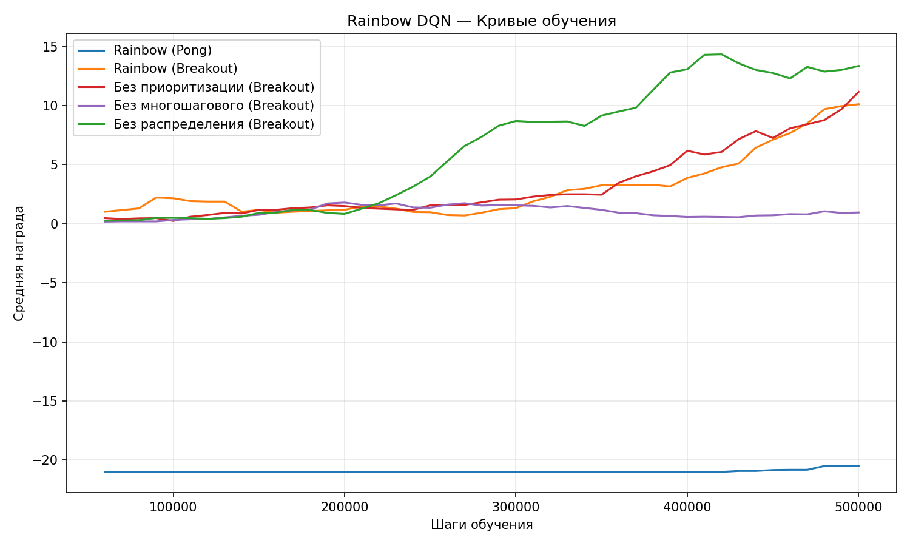

# Rainbow: Combining Improvements in Deep Reinforcement Learning

Реализация и экспериментальное исследование по статье:

> Hessel, M., Modayil, J., van Hasselt, H., Schaul, T., Ostrovski, G., Dabney, W., Horgan, D., Piot, B., Azar, M., & Silver, D. (2018). *Rainbow: Combining Improvements in Deep Reinforcement Learning*. AAAI 2018. [arXiv:1710.02298](https://arxiv.org/abs/1710.02298)

## Алгоритм

Rainbow DQN объединяет шесть расширений алгоритма DQN:
1. **Double Q-learning** — разделяет выбор и оценку действия для уменьшения переоценки Q-значений.
2. **Prioritized Experience Replay** — выбирает переходы пропорционально величине TD-ошибки.
3. **Dueling Networks** — раздельно оценивает ценность состояния V(s) и преимущество действий A(s, a).
4. **Multi-step Learning** (n=3) — использует усечённые n-шаговые награды для ускорения распространения сигнала.
5. **Distributional RL** (C51) — обучает категориальное распределение наград вместо скалярного среднего.
6. **NoisyNet** — заменяет ε-greedy исследование параметрическим шумом в весах сети.

Реализация во многом адаптирована из репозитория [Kaixhin/Rainbow](https://github.com/Kaixhin/Rainbow).

## Результаты

### Кривые обучения



Все эксперименты проведены в **500K шагов** (2M кадров). В статье используется 200M кадров (50M шагов) — наш бюджет составляет **1%** от полного. Этим объясняются неполные результаты.

### Итоговые результаты

| Эксперимент | Средняя награда | Игра |
|---|---|---|
| Rainbow | 11.4 | Breakout |
| Без Prioritized Experience Replay | 13.5 | Breakout |
| Без Multi-step Learning (n=1) | 0.8 | Breakout |
| Без C51 | 13.9 | Breakout |
| Rainbow | −20.6 | Pong |

### Анализ результатов

- **Multi-step Learning (n=3) — самый важный компонент.** Его удаление катастрофически снижает производительность (11.4 → 0.8), что полностью согласуется с абляционным исследованием статьи (Рисунок 4): многошаговые награды обеспечивают более быстрое распространение сигнала и существенно ускоряют раннее обучение.
- **Rainbow не превосходит все абляции при 500K шагах.** Версии без приоритизации (13.5) и без распределения (13.9) показали результат выше Rainbow (11.4). Это ожидаемое поведение при ограниченном кол-ве шагов обучения:
- **C51** обучает полное распределение из 51 атома вместо одного скаляра, что требует значительно больше данных для сходимости. В статье отмечается, что эффект распределённого RL проявляется только после ~40M кадров, что в 20 раз больше нашего бюджета.
- **Prioritized Experience Replay** вносит смещение в выборку, которое корректируется importance sampling весами (β: 0.4 → 1.0). На раннем этапе обучения это смещение может замедлять сходимость.
- Статья демонстрирует преимущество Rainbow на длинной дистанции (50M шагов), где все компоненты усиливают друг друга.
- **Pong (−20.6)** показывает начальные признаки обучения (отдельные эпизоды с наградой −19.0), но 500K шагов недостаточно для уверенного улучшения. Обучение на Pong требует ~1–2M шагов.

## Выбранные эксперименты

Из полного набора экспериментов статьи выбраны 5 — топ-3 абляции по важности (Рисунок 4 статьи) плюс два базовых запуска для проверки обобщаемости:

1. Rainbow на Pong — валидация реализации на простейшей игре.
2. Rainbow на Breakout — проверка обобщаемости на более сложной игре.
3. Без Prioritized Experience Replay (Breakout) — абляция 1-го по важности компонента.
4. Без Multi-step Learning, n=1 (Breakout) — абляция 2-го по важности компонента.
5. Без Distributional RL / C51 (Breakout) — абляция 3-го по важности компонента.

## Структура проекта

```
rainbow/
├── rainbow/
│   ├── __init__.py
│   ├── agent.py          # Агент Rainbow с поддержкой абляций
│   ├── env.py            # Обёртка среды Atari (Gymnasium)
│   ├── memory.py         # Приоритизированное воспроизведение (дерево отрезков)
│   ├── model.py          # NoisyLinear + дуэльная архитектура DQN
│   └── test.py           # Утилиты оценки
├── experiments/
│   ├── 01_pong.sh                     # Полный Rainbow на Pong
│   ├── 02_breakout.sh                 # Полный Rainbow на Breakout
│   ├── 03_no_priority_breakout.sh     # Абляция: без приоритизации
│   ├── 04_no_multistep_breakout.sh    # Абляция: без многошагового
│   ├── 05_no_distributional_breakout.sh # Абляция: без распределения
│   ├── run_all.sh                     # Запуск всех экспериментов
│   ├── plot_results.py                # Построение графиков
│   └── results/                       # Результаты (создаётся автоматически)
├── main.py                # Точка входа (Typer CLI)
├── pyproject.toml         # Зависимости и конфигурация
└── README.md
```

## Использование

### Установка

```bash
uv sync
```

### Запуск всех экспериментов

```bash
# По умолчанию: 500K шагов на эксперимент
bash experiments/run_all.sh
```

### Запуск отдельных экспериментов

```bash
bash experiments/01_pong.sh

# Или напрямую через CLI
uv run python main.py --game Breakout --id rainbow_breakout --t-max 500000
uv run python main.py --game Breakout --id no_priority --no-priority
uv run python main.py --game Breakout --id no_multistep --multi-step 1
uv run python main.py --game Breakout --id no_distrib --no-distributional
```

### Построение графиков

```bash
uv run python experiments/plot_results.py
```

### Справка по CLI

```bash
uv run python main.py --help
```

## Гиперпараметры

| Параметр | Значение | В статье |
|---|---|---|
| Шаги обучения | 500K | 50M |
| Скорость обучения Adam | 6.25 × 10⁻⁵ | 6.25 × 10⁻⁵ |
| Эпсилон Adam | 1.5 × 10⁻⁴ | 1.5 × 10⁻⁴ |
| Коэффициент дисконтирования γ | 0.99 | 0.99 |
| Ёмкость буфера воспроизведения | 100K | 1M |
| Шагов до начала обучения | 20K | 80K |
| Период обновления целевой сети | 8K | 32K |
| Многошаговые награды n | 3 | 3 |
| Атомов распределения | 51 | 51 |
| Носитель распределения | [−10, 10] | [−10, 10] |
| σ₀ NoisyNet | 0.1 | 0.5 |
| Экспонента приоритета ω | 0.5 | 0.5 |
| Начальный вес важности β | 0.4 → 1.0 | 0.4 → 1.0 |
| Размер батча | 32 | 32 |
| Обрезка награды | [−1, 1] | [−1, 1] |

Отличия от статьи: уменьшены ёмкость буфера (100K vs 1M), порог начала обучения (20K vs 80K), период обновления целевой сети (8K vs 32K) и σ₀ NoisyNet (0.1 vs 0.5, по рекомендации Kaixhin) для ускорения обучения при ограниченном бюджете.
